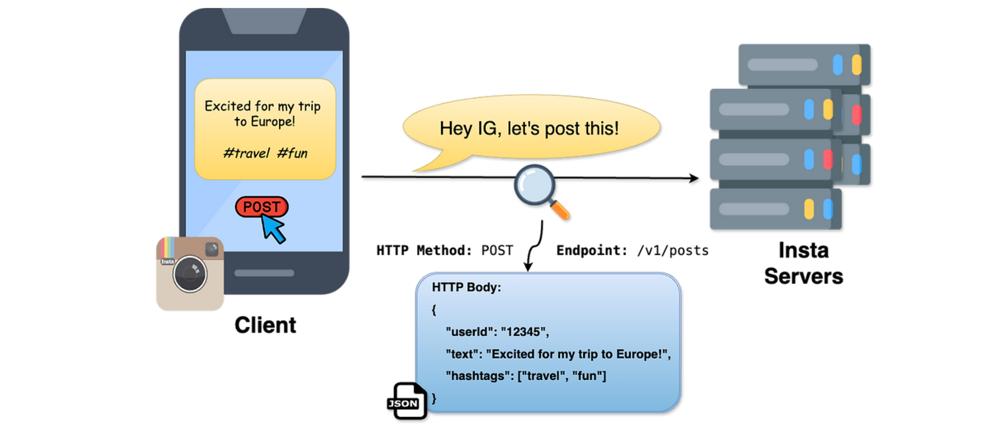
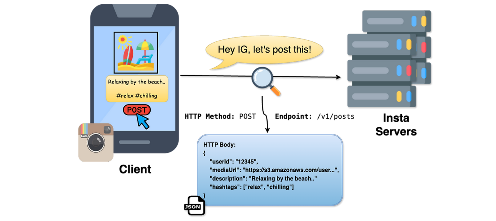
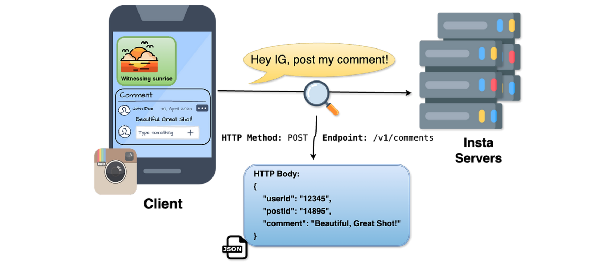
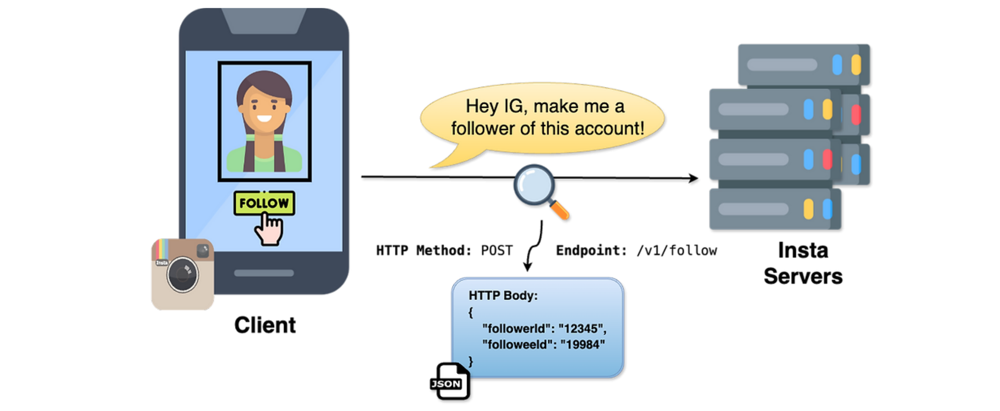
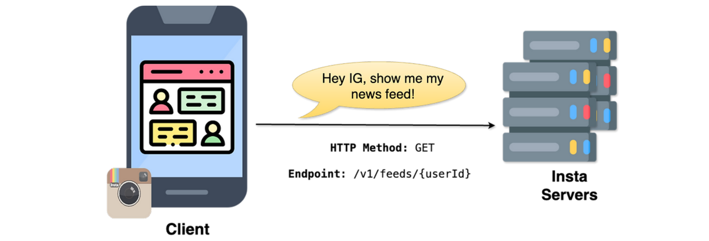

## Criar um Post de Texto

Vamos começar com o design da API, pelo design da API para criar um post de texto. Vamos dar um zoom na comunicação para criar um post de texto e entender exatamente o que está acontecendo ali.

Quando pedimos ao servidor para criar um post de texto, usamos uma chamada de API. É assim que os computadores conversam entre si — aqui estamos usando algo chamado REST, um estilo de API (RESTful APIs). Então, quando o cliente quer postar algo — digamos que ele queira postar "Animado para minha viagem à Europa #travel #fun" —, isso vai para o servidor.

Vamos dar um zoom nessa parte. Segundo o REST, existem três partes aqui: a primeira é o método HTTP, a segunda é o endpoint, e a terceira é o body (corpo).

**Método HTTP.** Diz ao servidor qual ação executar. Como queremos criar algo novo no servidor — nesse caso, um novo post —, usamos a ação POST.

**Endpoint.** Diz ao servidor onde executar essa ação. Como estamos criando um post, usamos "/v1/posts". "Posts" é compreensível, mas e o "v1"? V1 significa versão 1 (version one) — geralmente é uma boa prática versionar a sua API.

**Body.** Já dissemos ao servidor que queremos criar um post de texto, mas ainda não dissemos quais são os detalhes desse post — essa informação é enviada no corpo da requisição (request body). O body tem três elementos principais: o user ID, que identifica o usuário que criou o post; o text, que descreve o conteúdo do post (nesse caso, "Animado para minha viagem à Europa"); e a hashtag, a tag incluída no post (nesse caso, #travel #fun).

Tudo isso combinado — método, endpoint e body — nos mostra como projetamos a API para criar um post de texto.

```http
POST /v1/posts
{
  "userId":   "u_123",
  "text":     "Animado para minha viagem à Europa",
  "hashtags": ["#travel", "#fun"]
}
```



*O que a imagem mostra:* o cliente (celular) escreve o texto e as hashtags e toca em "POST"; essa ação é traduzida na chamada "Hey IG, let's post this!", que chega ao servidor como uma requisição HTTP — o ícone da lupa representa exatamente o zoom que fizemos nessa comunicação. Do lado direito, o balão de HTTP Body mostra o JSON reproduzido acima (userId, text, hashtags) sendo entregue aos servidores do Instagram.


## Criar um Post de Imagem ou Vídeo

Agora vamos para o design da API para criar um post de imagem ou vídeo. O fluxo geral é bem parecido com o que vimos ao criar um post de texto, mas há algumas diferenças.

Olhando o método HTTP e o endpoint, é bem parecido: como queremos criar algo, usamos o método POST, e o endpoint é o mesmo, "/v1/posts". O body também é bem parecido: temos a description (descrição), onde escrevemos o texto do post, depois as hashtags, e o user ID de quem está postando.

Mas, no body, há um detalhe a mais: existe uma media URL. O que isso significa? Como o cliente está tentando criar um post de imagem ou vídeo, ele primeiro precisa fazer upload dessa imagem ou vídeo para os servidores do Instagram.

Primeiro, essa imagem ou vídeo é enviado para algo chamado object storage (armazenamento de objetos). O object storage é um lugar onde todo o conteúdo estático é salvo — vídeos, imagens e outros documentos volumosos e estáticos são salvos nesse armazenamento.

Assim que o upload termina, seguimos para a requisição. Essa media URL tem um formato como "https://s3.amazonaws.com/..." — a Amazon oferece um serviço de armazenamento de objetos chamado Amazon S3. Esse link indica que a imagem ou o vídeo já foi enviado ao armazenamento de objetos, e essa é a localização daquele arquivo.

Então, nessa requisição, o body traz, junto com o user ID, a description e as hashtags, também a media URL: é como dizer "Instagram, aqui estão os detalhes do post, junto com onde está o meu arquivo de mídia — pode salvar isso no servidor ou no banco de dados".

Resumindo o fluxo: primeiro há uma requisição inicial ao object storage, onde o arquivo de mídia é armazenado. Depois, enviamos uma requisição ao servidor do Instagram com método HTTP POST, endpoint "/v1/posts", e body contendo o user ID, a description, as hashtags e a media URL.

```http
POST /v1/posts
{
  "userId":      "u_123",
  "description": "Animado para minha viagem à Europa",
  "hashtags":    ["#travel", "#fun"],
  "mediaUrl":    "https://s3.amazonaws.com/bucket/media/abc123.mp4"
}
```



*O que a imagem mostra:* o mesmo fluxo do post de texto, mas agora o post já inclui uma imagem anexada no celular. O JSON no HTTP Body traz um campo a mais em relação ao post de texto — `mediaUrl` —, que é justamente a localização do arquivo no object storage (S3) mencionada no texto acima; `description` substitui o `text` simples, mas o papel é o mesmo.


## Curtir ou Comentar em um Post

Agora vamos fazer o design da API para curtir ou comentar em um post. Vamos dar um zoom na comunicação para curtir ou comentar em um post e entender exatamente o que está acontecendo ali. Vamos usar REST API para essa comunicação também.

Digamos que você é o cliente e tenta comentar na foto de alguém, dizendo "linda, ótima foto". Essa informação — esse comentário — vai para o servidor do Instagram. Vamos entrar nessa parte da comunicação: o método HTTP, o endpoint e o body.

Como sabemos, o método HTTP diz ao servidor qual ação executar. Como estamos adicionando algo ao servidor — nesse caso, um comentário —, usamos o POST. Da mesma forma, o endpoint diz onde executar essa ação: como estamos adicionando um comentário, usamos o endpoint "/v1/comments" do servidor.

Já o body é bem simples: há três elementos — o user ID de quem está adicionando o comentário, o post ID no qual o comentário foi feito, e o comment (o texto do comentário).

```http
POST /v1/comments
{
  "userId":  "u_123",
  "postId":  "p_456",
  "comment": "linda, ótima foto"
}
```



*O que a imagem mostra:* o material oficial do curso ilustra esse padrão de API (curtir/comentar) usando o exemplo de comentário — o usuário digita "Beautiful, Great Shot!" embaixo do post e envia; o corpo da requisição HTTP carrega exatamente os três campos do JSON acima (userId, postId, comment). O fluxo de curtida usa a mesma estrutura de comunicação, só trocando o endpoint e o body, como mostrado a seguir.

Falamos bastante sobre comentários, mas não sobre curtidas (likes). O fluxo para curtir é bem parecido: sempre que um usuário curte um post, podemos enviar uma requisição POST no endpoint "/v1/likes", com o user ID e o post ID no body.

```http
POST /v1/likes
{
  "userId": "u_123",
  "postId": "p_456"
}
```

## Seguir ou Deixar de Seguir Outro Usuário

Agora vamos ver o design da API para seguir e deixar de seguir outro usuário. Vamos dar um zoom na comunicação de quando seguimos outro usuário e entender exatamente o que está acontecendo ali. Vamos usar REST API novamente aqui.

O usuário está tentando seguir outro usuário, que é seu amigo. Essa mensagem vai para os servidores — aqui, o cliente está dizendo aos servidores do Instagram: "me torne um seguidor dessa conta". Vamos entrar a fundo nessa parte da comunicação.

Como sabemos, o método HTTP diz ao servidor qual ação executar. Como estamos criando um dado no servidor — um novo relacionamento de "seguir", ou seja, que essa pessoa passa a seguir outro usuário —, usamos o método HTTP POST.

Em seguida, o endpoint diz ao servidor onde executar essa ação. Como um usuário está seguindo outro usuário, usamos o endpoint "/v1/follow" do servidor.

Por último, temos o body, que consiste em duas coisas: o follower ID e o followee ID. O follower ID é o ID da pessoa que está tentando seguir outro usuário, e o followee ID é o ID da pessoa que está sendo seguida.

```http
POST /v1/follow
{
  "followerId": "u_123",
  "followeeId": "u_789"
}
```



*O que a imagem mostra:* o usuário toca em "FOLLOW" no perfil de outra pessoa; isso é traduzido na mensagem "Hey IG, make me a follower of this account!", que vira a requisição POST para "/v1/follow" com o followerId (quem está seguindo) e o followeeId (quem está sendo seguido) — os mesmos dois campos do JSON acima.


## Ler o Newsfeed (Timeline)

Agora vamos para o design da API para ler o newsfeed, ou ler a timeline. Vamos dar um zoom na comunicação. Quando o usuário está tentando ler o newsfeed, vamos usar REST API também aqui. Nessa comunicação, precisamos focar em duas coisas: o método HTTP e o endpoint.

O método HTTP aqui é o GET. Como sabemos, o método HTTP diz ao servidor qual ação executar. Como queremos buscar dados — ou seja, buscar o newsfeed do servidor —, usamos o método GET.

Em seguida, temos o endpoint, que diz ao servidor onde executar essa ação. Como estamos tentando buscar o newsfeed do usuário, usamos o endpoint "/v1/feed/{userId}" do servidor. "v1/feed" nos diz que queremos obter o newsfeed, e o userId nos diz para quem queremos obter esse newsfeed — por isso temos "/v1/feed/{userId}".

Você deve estar pensando: por que não há um body? Requisições GET não têm body — estamos apenas pedindo ao servidor que nos entregue esse dado, então não há necessidade de um body para isso.

```http
GET /v1/feed/{userId}
```



*O que a imagem mostra:* o celular pede "Hey IG, show me my news feed!" — uma requisição GET simples, sem HTTP Body, para o endpoint "/v1/feeds/{userId}" (equivalente ao "/v1/feed/{userId}" usado neste documento; algumas versões do material do curso usam o plural "feeds"). É esse pedido que o high-level design, na próxima seção, detalha por trás dos panos.

---

> **Resumo rápido — pontos-chave para a entrevista**
>
> - Criar post (texto ou mídia): POST /v1/posts — body com userId, text/description, hashtags e, para mídia, mediaUrl.
> - Curtir: POST /v1/likes. Comentar: POST /v1/comments — ambos levam userId + postId (comentário também leva o texto).
> - Seguir/deixar de seguir: POST /v1/follow — body com followerId e followeeId.
> - Ler o newsfeed: GET /v1/feed/{userId} — sem body, porque GET só busca dados.
> - Dica de entrevista: repare no padrão — método diz a ação (POST cria, GET lê), endpoint diz o recurso, e é só a partir daqui que o design da API vira o "contrato" que orienta todo o high-level design a seguir.