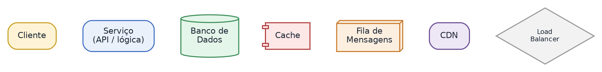
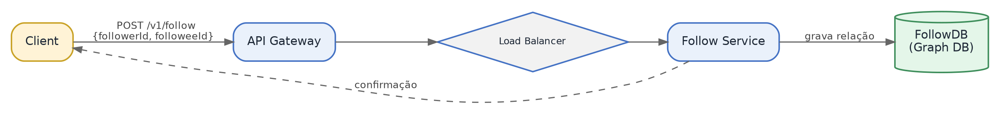
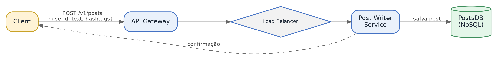
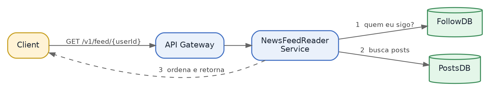
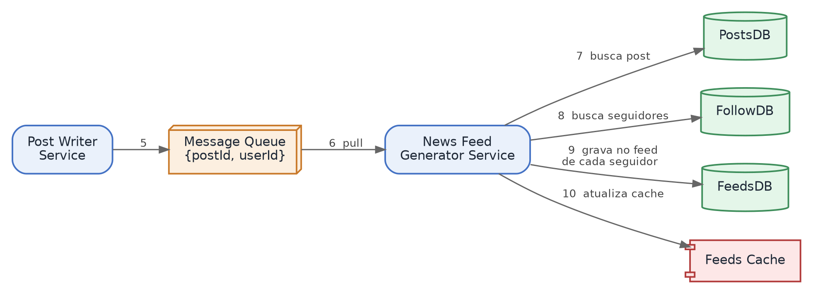
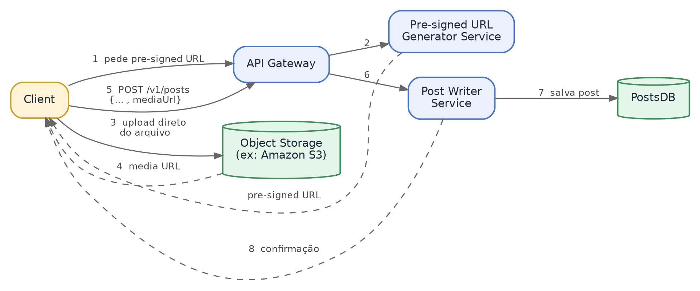
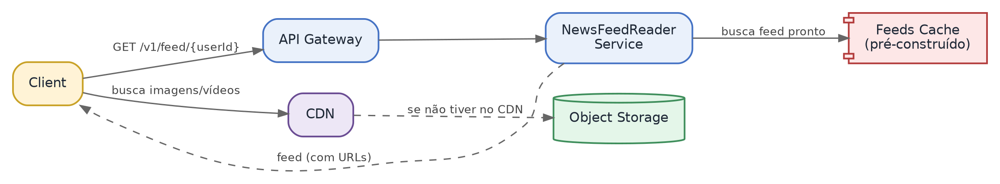
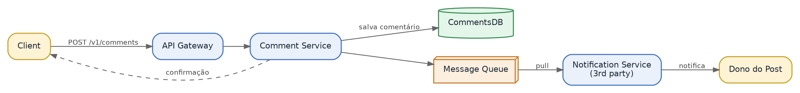
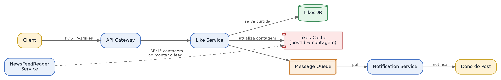

<!-- Parte do case: Sistema de Newsfeed (Instagram) — System Design Masterclass -->

# High-Level Design

Antes de entrar nos fluxos, aqui está a legenda de cores e formas usada em todos os diagramas desta seção (e do Deep Dive, mais adiante):



## Seguir ou Deixar de Seguir Outro Usuário

Agora vamos começar com o high-level design (design de alto nível). Vamos fazer o high-level design para seguir ou deixar de seguir outro usuário. Vamos dar uma olhada rápida no diagrama e tentar entender isso melhor.

Quando um usuário segue ou deixa de seguir outro usuário, geralmente acontecem os seguintes passos:

**Passo 1.** Quando um usuário tenta seguir outro usuário, uma requisição POST é enviada diretamente ao API gateway. Como já vimos na seção de design da API, essa requisição é enviada ao endpoint "/v1/follow", com o body contendo o followee ID e o follower ID.

**Passo 2.** O API gateway lida com essa requisição de entrada de forma organizada e a encaminha para o follow service através de um load balancer (balanceador de carga).

**Passo 3.** O follow service atualiza o followDB (banco de dados de follow), armazenando o relacionamento — ou mapeamento — entre follower e followee. É por isso que usamos bancos de dados de grafo (graph databases) aqui.

**Passo 4 (e último).** O cliente recebe a confirmação de que a requisição de follow foi bem-sucedida.

Agora, para o followDB, usamos algo chamado bancos de dados de grafo (graph databases) — um tipo de banco de dados especializado em armazenar relacionamentos entre dados.

O que significa esse relacionamento entre dados? No nosso caso, temos um follower e um followee: o follower está tentando seguir o followee, e existe um relacionamento entre os dois. De forma parecida, no Facebook, temos uma pessoa tentando ser amiga de outra pessoa. Esses tipos de relacionamento são muito bem armazenados em bancos de dados de grafo, e é por isso que os usamos aqui.

Voltando ao fluxo: esses quatro passos combinados nos dão o fluxo para seguir e deixar de seguir outro usuário.



## Criar um Post de Texto

Agora vamos tentar fazer o high-level design para criar um post de texto. Olhando o diagrama, estes são os passos envolvidos:

**Passo 1.** Quando o usuário escreve um post de texto e clica em enviar (submit), uma requisição POST é enviada com os detalhes do post. Essa requisição chega ao API gateway.

**Passo 2.** O API gateway lida com essa requisição de entrada e a encaminha para o post writer service através de um load balancer.

**Passo 3.** O post writer service salva o novo post no banco de dados, chamado de PostsDB.

**Passo 4.** O cliente recebe a confirmação de que o post foi criado com sucesso.

Então, até aqui, pegamos o post do usuário e o salvamos no banco de dados.



## Ler o Newsfeed (Versão Inicial)

Agora que já sabemos o high-level design para criar um post de texto, podemos olhar o high-level design de como ler um newsfeed. É assim que o fluxo funciona:

**Passo 1.** O usuário envia uma requisição para ler o seu newsfeed. Do que é feito esse newsfeed? Ele consiste em posts das contas que o usuário segue. Digamos que o usuário A segue os usuários B e C — o usuário A vai ver os posts de B e C.

**Passo 2.** A requisição chega ao news feed reader service. Para conseguir todos os posts necessários, o news feed reader service realiza três sub-passos:

1) Busca todas as contas seguidas no followDB — no exemplo, uma lista com B e C.

2) Lê os posts dessas contas usando o PostsDB.

3) Ordena todos os posts em ordem cronológica reversa (do mais novo para o mais antigo) — necessário porque, depois dos dois primeiros sub-passos, o news feed reader service tem uma coleção de posts de B e C organizados aleatoriamente, sem nenhuma ordenação.

Esses três sub-passos são basicamente como um newsfeed é construído. Depois que tudo isso é feito, os posts ordenados são retornados ao cliente como o newsfeed.

Se observarmos esse design de perto, muitos passos estão envolvidos na leitura do newsfeed: primeiro, ele lê do followDB; segundo, ele lê do PostsDB; e terceiro, ele ordena os posts. Toda vez que alguém lê o seu newsfeed, todos esses passos precisam ser feitos — isso pode tornar a leitura do newsfeed muito lenta, o que é bem frustrante, já que checamos o newsfeed com frequência.

Curiosamente, se você abrir o Instagram e carregar o seu newsfeed, vai ver que é bem rápido. Então, definitivamente estamos deixando passar alguma coisa — devemos pensar em otimizar o nosso design. A seguir, vamos otimizar esse design.



## Criar um Post de Texto (Continuação) — Otimizando com Fan-out na Escrita

Vamos continuar com o nosso design para criar um post de texto. Até agora, criamos um design para criar um post de texto e ler o newsfeed, mas o nosso design é sub-ótimo: toda vez que alguém lê o newsfeed, muita computação precisa ser feita — ler do followDB, ler do PostsDB e ordenar os posts em ordem cronológica reversa. Vamos otimizar o nosso design agora.

Uma ideia interessante aqui é: e se pudéssemos preparar o newsfeed com antecedência? Assim, quando alguém tentar ler o seu newsfeed, isso será instantâneo, porque já estará pronto para essa pessoa. Vamos ver essa otimização em ação.

Os passos 1 a 4 continuam os mesmos — o post writer service adiciona o novo post ao PostsDB e retorna uma confirmação ao cliente. Vamos olhar o passo 5 em diante.

**Passo 5.** Assim que os posts são adicionados ao PostsDB, o post writer service também coloca esse evento — post ID e user ID — em uma fila de mensagens (message queue). Por exemplo, se o user ID for "usuário A" e o post ID for "post A", ele adiciona "post A, usuário A" na fila.

```json
// evento colocado na message queue
{
  "postId": "post_A",
  "userId": "usuario_A"
}
```

Agora vamos ter outro serviço responsável por criar o newsfeed, chamado news feed generator service. A única responsabilidade dele é criar o newsfeed para todos os usuários.

**Passo 6.** O news feed generator service retira (pull) esse evento da fila de mensagens para processamento.

**Passo 7.** O news feed generator service busca os dados do novo post no PostsDB, usando o post ID (post A). Agora ele tem o post completo.

**Passo 8.** O news feed generator service encontra todos os seguidores desse usuário usando o followDB. Digamos que o usuário A é seguido pelos usuários B e C — o serviço obtém essa lista (usuário B, usuário C) do followDB.

**Passo 9.** O news feed generator service adiciona esse novo post ao feed de todos os seguidores — ou seja, adiciona o post do usuário A ao newsfeed do usuário B e do usuário C. Todos os newsfeeds de todos os usuários são armazenados no feedsDB. Uma entrada nesse banco é um mapeamento de user ID para o newsfeed: por exemplo, para o usuário B, teríamos um mapeamento de "usuário B" para, digamos, post 1, post 2, post 3 — o newsfeed completo dele.

**Passo 10 (e último).** A mesma informação é então atualizada no feeds cache, para acesso mais rápido.

Então, todos esses 10 passos combinados nos dão o high-level design completo para criar um post de texto.



## Criar um Post de Imagem ou Vídeo

Agora vamos para o high-level design para criar um post de imagem ou vídeo. Ao criar um post de texto, enviamos os dados de texto no body. Mas como enviamos imagens ou vídeos, que são grandes, dentro do body? Enviar imagens e vídeos no corpo da requisição não é eficiente — são arquivos grandes e podem deixar o processo lento. E se encontrássemos outra forma de fazer isso?

Uma solução possível: o cliente faz upload da imagem ou vídeo para um object storage gerenciado pelo Instagram, e depois envia a localização desse arquivo aos servidores do Instagram. Ou seja: há uma requisição inicial em que o usuário faz upload do conteúdo para o object storage; assim que o upload termina, o cliente recebe a localização do arquivo; e então envia outra requisição ao servidor do Instagram, colocando a URL da imagem/vídeo no corpo da requisição. Essa URL é então salva no banco de dados.

Vamos entender isso passo a passo, olhando o diagrama:

**Passo 1.** O cliente solicita uma URL pré-assinada (pre-signed URL) ao API gateway para fazer upload da imagem ou do vídeo. Essa é uma URL especial que permite ao cliente fazer upload diretamente para o object storage, de forma segura.

**Passo 2.** O API gateway recebe essa requisição e a encaminha para o pre-signed URL generator service através de um load balancer — um serviço especializado apenas em gerar essas URLs pré-assinadas e devolvê-las ao cliente.

**Passo 3.** O cliente faz upload da imagem ou do vídeo diretamente para o object storage, usando essa URL pré-assinada.

**Passo 4.** O object storage retorna ao cliente a URL da imagem enviada — a localização desse arquivo no object storage.

**Passo 5.** O cliente usa essa URL no corpo da requisição e envia uma requisição POST ao API gateway.

**Passo 6.** O API gateway lida com a requisição e a encaminha para o post writer service através de um load balancer.

**Passo 7.** O post writer service salva o novo post no PostsDB.

**Passo 8.** O cliente recebe a confirmação de que o post foi criado com sucesso.

**Passo 9.** O post writer service também coloca esse evento (post ID e user ID) na fila de mensagens — bem parecido com o design para criar um post de texto. O news feed generator service retira esse evento da fila para processamento.

**Passo 10.** O news feed generator service busca os dados do novo post no PostsDB, usando o post ID do evento.

**Passo 11.** O news feed generator service encontra todos os seguidores desse usuário usando o followDB.

**Passo 12.** O news feed generator service adiciona o novo post ao feed de todos os seguidores, construindo o newsfeed de cada usuário e armazenando-o no feedsDB.

**Passo 13 (e último).** A mesma informação é atualizada no feeds cache, para acesso mais rápido.

Se observarmos com atenção, a maioria dos passos é semelhante ao high-level design para criar um post de texto — a única diferença é a parte da pre-signed URL e o upload para o object storage.



## Ler o Newsfeed (Versão Otimizada)

Agora vamos para o high-level design de leitura do newsfeed, já com a otimização que vimos. Vamos olhar o diagrama e entender o fluxo de ponta a ponta:

**Passo 1.** Quando o usuário tenta carregar o seu newsfeed, uma requisição GET é enviada ao API gateway, no endpoint "/v1/feed/{userId}" — o mesmo que vimos na seção de design da API.

**Passo 2.** O API gateway recebe essa requisição e a encaminha para o NewsFeedReader service através do load balancer — um serviço especializado apenas em ler os newsfeeds.

**Passo 3.** O NewsFeedReader service busca o newsfeed já pré-construído no feeds cache. Como vimos no high-level design de criação de post, todo post é salvo no feedsDB e no feeds cache — então aqui o serviço só precisa buscar o newsfeed pré-pronto no cache.

**Passo 4.** O NewsFeedReader service devolve o newsfeed ao usuário. Mas esse newsfeed contém apenas as URLs das imagens e vídeos dos posts, não os arquivos de mídia em si. Por isso, o cliente busca a imagem e o vídeo reais na CDN usando essas URLs; se o conteúdo não estiver na CDN, ela busca no object storage. Só então o usuário consegue ver o seu newsfeed completo.

Uma curiosidade: você já reparou que, às vezes, ao abrir o app do Instagram, você só vê o texto, sem as imagens e vídeos? É por isso que isso acontece — o texto chega primeiro, e para as imagens e vídeos o cliente precisa acessar a CDN. É por isso que, às vezes, as imagens e vídeos aparecem um pouco depois do texto.

Isso encerra o high-level design para ler o newsfeed.



## Comentar em um Post

Agora vamos ver o high-level design para comentar em um post. Como se vê no diagrama, quando um usuário comenta em um post, estes são os passos envolvidos:

**Passo 1.** O usuário escreve um comentário e clica em enviar (submit). Uma requisição POST é enviada ao endpoint "/v1/comments" com os dados do comentário. Isso vai para o API gateway.

**Passo 2.** O API gateway lida com essa requisição de entrada e a encaminha para o comment service através de um load balancer.

**Passo 3.** O comment service processa esse comentário e o armazena no CommentsDB.

**Passo 4.** Depois desses três passos, o cliente recebe a confirmação.

Agora, uma pergunta rápida: você já viu aquelas notificações no celular avisando que alguém comentou no seu post? O nosso design leva essa parte em conta também — por isso temos uma fila de mensagens (message queue) ali.

**Passo 5.** O comment service adiciona um evento (user ID, post ID) na fila de mensagens.

**Último passo.** O notification service retira esse evento da fila de mensagens e notifica o dono do post — a pessoa recebe uma notificação de que alguém comentou no seu post. O notification service é um serviço de terceiros (third party): não é algo que desenvolvemos, é um serviço externo que usamos.

Todos esses passos combinados nos dão o high-level design para comentar em um post.



## Curtir um Post

Agora vamos para o high-level design de curtir um post. Quando um usuário curte um post, estes são os passos envolvidos. Isso é bem parecido com o high-level design de comentar em um post, mas com uma pequena diferença. Vamos passar por todos os passos:

**Passo 1.** O usuário clica no botão de curtir, o que envia uma requisição POST ao endpoint "/v1/likes" no API gateway.

**Passo 2.** O API gateway lida com essa requisição e a encaminha para o like service através de um load balancer.

**Passo 3.** O like service processa a curtida e a armazena no LikesDB. Todos esses passos até aqui são bem parecidos com os dos comentários.

**Passo 4.** Para acelerar o acesso, o like service também atualiza o likes cache. Esse cache contém o mapeamento entre o post ID e a contagem de curtidas dele. Por exemplo, para três posts A, B e C: o post A com 1.000 curtidas, o post B com 2.000, e assim por diante — tudo isso fica salvo no likes cache.

**Passo 5.** O like service coloca esse evento (user ID, post ID) na fila de mensagens.

**Passo 6.** O notification service retira esse evento da fila de mensagens e notifica o dono do post de que alguém curtiu a publicação dele.

**Passo 7.** O dono do post vê que alguém curtiu o post e fica bem feliz.

Como se pode notar, atualizamos o likes cache para que o número de curtidas possa ser exibido de forma eficiente no newsfeed. Mas ainda não mostramos como esse likes cache é usado no fluxo de leitura do newsfeed. Para completar, acrescentamos o passo 3B, em que o NewsFeedReader service busca os dados de curtidas no likes cache.

Com tudo isso incluído, encerramos o nosso high-level design para curtir um post — e, com ele, toda a seção de High-Level Design do sistema de newsfeed.



> **Resumo rápido — pontos-chave para a entrevista**
>
> - Escrita (criar post): API Gateway → Load Balancer → Post Writer Service → PostsDB, com confirmação síncrona ao cliente.
> - Fan-out na escrita: o post writer service publica um evento (postId, userId) numa message queue; o news feed generator service consome esse evento, busca os seguidores no followDB e grava o post no feed de cada um deles (feedsDB + feeds cache) — assim a leitura do feed vira só uma busca em cache, sem juntar/ordenar nada na hora.
> - Leitura do feed: NewsFeedReader busca o feed pronto no cache e devolve só as URLs de mídia; o cliente busca as imagens/vídeos direto na CDN (e daí o texto aparecer antes da mídia).
> - Curtir/comentar seguem o mesmo padrão de escrita + fila de mensagens + notification service (serviço de terceiros); curtidas também atualizam um likes cache lido no passo 3B da leitura do feed.
> - Dica de entrevista: fan-out na escrita troca leitura lenta por escrita mais cara (um post gera N gravações, uma por seguidor) — saiba explicar esse trade-off e mencionar a alternativa (fan-out na leitura) para usuários com milhões de seguidores.
