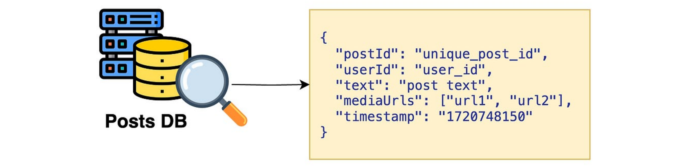
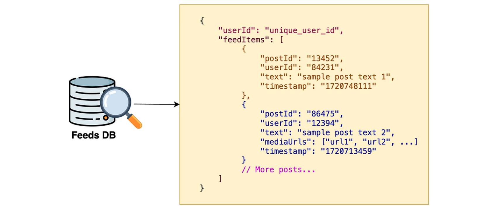
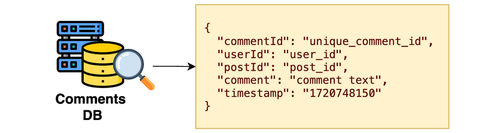
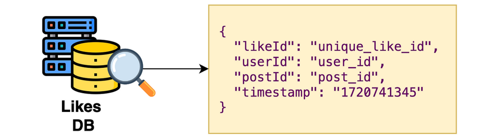
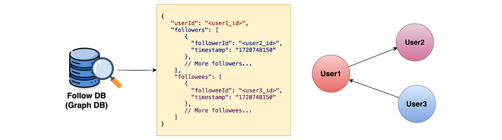
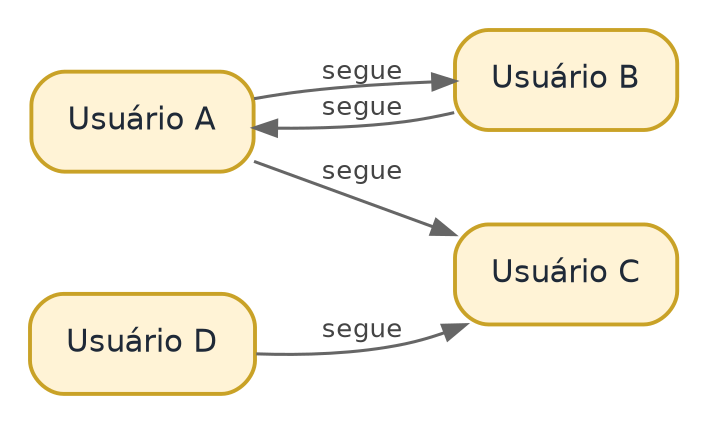
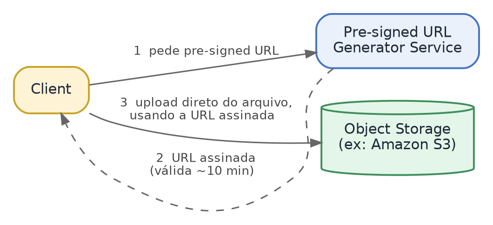
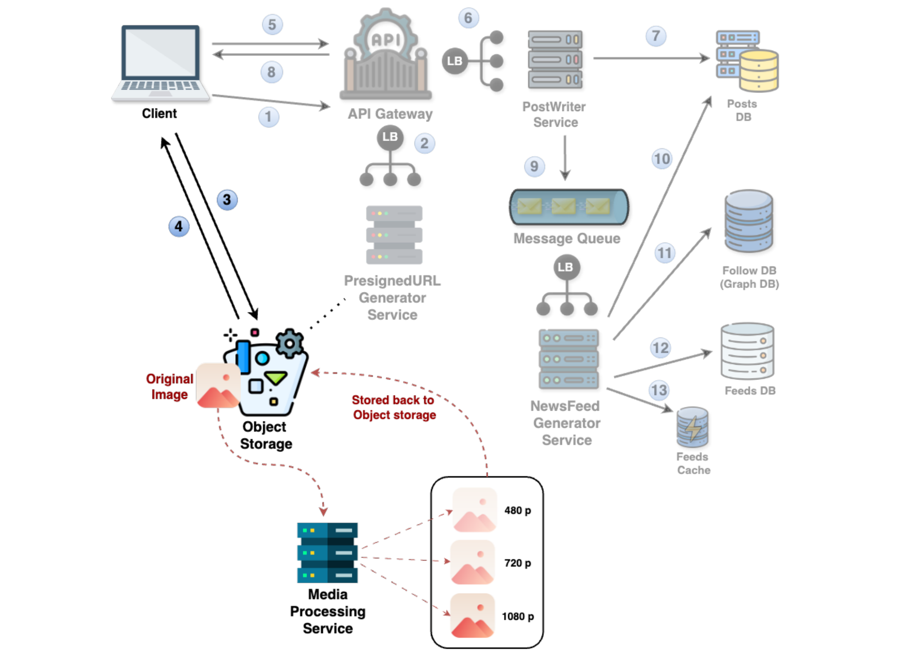

<!-- Parte do case: Sistema de Newsfeed (Instagram) — System Design Masterclass -->

# Deep Dive

## Seleção de Banco de Dados

Agora vamos para os insights de aprofundamento (deep dive). A primeira coisa que vamos ver é a seleção de banco de dados. Para decidir o tipo de banco de dados, aqui estão algumas diretrizes gerais — lembrando que nem sempre é uma resposta em preto e branco, muita coisa depende das necessidades do projeto:

1) Quando é preciso acesso rápido aos dados, o NoSQL geralmente é preferido em relação ao SQL.

2) Quando a escala é muito grande, os bancos NoSQL tendem a performar melhor que os SQL.

3) Quando os dados se encaixam em uma estrutura fixa, o SQL é mais adequado; quando não se encaixam, o NoSQL é a escolha.

4) Se há consultas (queries) complexas a executar, o SQL deve ser a escolha.

5) Se os dados mudam com frequência ou vão evoluir ao longo do tempo, opte pelo NoSQL — ele suporta uma estrutura flexível.

| Critério | Prefira NoSQL quando… | Prefira SQL quando… |
| --- | --- | --- |
| Velocidade de acesso | Acesso muito rápido aos dados é prioridade | — |
| Escala | A escala é muito grande | Escala moderada |
| Estrutura dos dados | Os dados não se encaixam em uma estrutura fixa | Os dados se encaixam em uma estrutura fixa |
| Consultas | — | Há consultas (queries) complexas a executar |
| Evolução do schema | Os dados mudam com frequência ou vão evoluir | Schema estável |

No nosso high-level design, temos cinco bancos de dados para decidir: PostsDB, FeedsDB, CommentsDB, LikesDB e FollowDB.

**PostsDB.** Posts de redes sociais podem incluir texto, imagens, vídeo e metadados — alguns posts têm só texto, outros só imagem ou vídeo, ou seja, não há estrutura fixa. A escala é muito alta (50 milhões de requisições de criação de post por dia, como vimos no throughput). E o padrão de consulta é simples: buscar um post pelo post ID, no fluxo de geração do newsfeed. Por não ter estrutura fixa, ter grande escala e consulta simples: escolha NoSQL.

**FeedsDB.** Armazena um mapeamento entre o user ID e o newsfeed dele. Como os posts não têm estrutura fixa, o FeedsDB também é naturalmente não estruturado, com a mesma alta escala (50 milhões/dia), e o padrão de consulta é simples: ler o newsfeed pelo user ID. Por isso: NoSQL também.

**CommentsDB.** Escala e throughput extremamente altos (1,5 bilhão de atividades por dia). Não tem schema fixo — os dados podem evoluir no futuro para incluir respostas a um comentário (comentários aninhados). O padrão de consulta mais comum é buscar todos os comentários de um post — simples, nada complexo. Escolha: NoSQL.

**LikesDB.** Bem parecido com o CommentsDB: 1,5 bilhão de atividades por dia. O schema também pode evoluir (diferentes tipos de reação, como "engraçado", "uau", "triste", "amei"). O padrão de consulta é simples: calcular o número de curtidas (para o likes cache) ou encontrar todos os usuários que curtiram um post. Escolha: NoSQL.

**FollowDB.** Armazena conexões e relacionamentos entre usuários (follower e followee). Podemos usar grafos para modelar isso: usuários como nós (nodes) e conexões como arestas (edges) — o que também ajuda a encontrar, de forma eficiente, a lista de seguidores e de seguidos de um usuário. Também é preciso suportar um grande número de usuários e relacionamentos (um usuário pode ter milhares ou milhões de seguidores). Escolha: GraphDB (banco de dados de grafo).

| Banco | Estrutura / Schema | Escala | Escolha |
| --- | --- | --- | --- |
| PostsDB | Sem estrutura fixa | Alta (50M/dia) | **NoSQL** |
| FeedsDB | Não estruturado | Alta (50M/dia) | **NoSQL** |
| CommentsDB | Sem schema fixo (pode evoluir) | Muito alta (1,5B/dia) | **NoSQL** |
| LikesDB | Sem schema fixo (pode evoluir) | Muito alta (1,5B/dia) | **NoSQL** |
| FollowDB | Relacionamentos (grafo) | Alta (milhões de conexões) | **GraphDB** |

Isso encerra a parte de seleção de banco de dados.

## Modelagem de Dados (Data Modeling)

Agora vamos para a modelagem de dados. Temos cinco bancos de dados para falar.

**PostsDB**

Naturalmente, o que queremos armazenar em um post? O post ID, o user ID, o texto, as media URLs e o timestamp de criação.

| Campo | Descrição |
| --- | --- |
| postId | Identifica o post de forma única. |
| userId | ID de quem criou o post. |
| text | Conteúdo de texto do post (quando houver). |
| mediaUrls | Localização das imagens/vídeos no object storage (quando o post tiver mídia). |
| timestamp | Momento em que o post foi criado. |

A consulta mais comum aqui é ler um post pelo post ID. Por isso, criamos um índice (index) no campo post ID — um índice funciona como um atalho para buscar os dados rapidamente.

*O que a imagem mostra:* o mesmo schema da tabela acima, mas como um documento JSON de exemplo — é assim que um registro do PostsDB se pareceria na prática, com a lupa simbolizando a consulta pelo post ID.

**FeedsDB**

De forma intuitiva, o FeedsDB deve conter o feed de posts de cada usuário.

| Campo | Descrição |
| --- | --- |
| userId | Identifica o usuário dono do newsfeed. |
| feedItems | Lista de posts que compõem o newsfeed desse usuário (cada item aponta para um post e seus dados). |

A consulta comum aqui é ler o newsfeed pelo user ID — por isso, indexamos com base no user ID.

*O que a imagem mostra:* o documento do FeedsDB para um usuário — o `userId` do dono do feed e a lista `feedItems`, onde cada item já é o post completo (postId, userId de quem postou, texto e/ou mediaUrls, timestamp), pronto para ser exibido sem precisar consultar o PostsDB de novo. É exatamente esse pré-cálculo que o fan-out na escrita (visto no High-Level Design) deixa pronto com antecedência.

**CommentsDB**

O CommentsDB inclui o comment ID, o user ID, o post ID, o texto do comentário e o timestamp.

| Campo | Descrição |
| --- | --- |
| commentId | Identifica unicamente um comentário. |
| userId | ID de quem criou o comentário. |
| postId | Em qual post o comentário foi feito. |
| comment | Texto do comentário. |
| timestamp | Momento em que o comentário foi feito. |

A consulta comum aqui é encontrar todos os comentários de um post específico — por isso, indexamos com base no post ID também.

*O que a imagem mostra:* um documento de exemplo do CommentsDB, com os cinco campos da tabela acima (commentId, userId, postId, comment, timestamp) — a busca típica aqui é "todos os comentários de um postId".

**LikesDB**

De forma parecida com o CommentsDB, o LikesDB tem um like ID, um user ID, um post ID e o timestamp.

| Campo | Descrição |
| --- | --- |
| likeId | Identifica a curtida. |
| userId | ID de quem curtiu. |
| postId | Em qual post a curtida foi feita. |
| timestamp | Momento em que a curtida aconteceu. |

As consultas comuns aqui são: calcular o número de curtidas de um post, e encontrar todos os usuários que curtiram um post específico. Em ambos os casos, indexar pelo post ID traz bastante benefício — por isso, indexamos com base no post ID.

*O que a imagem mostra:* um documento de exemplo do LikesDB (likeId, userId, postId, timestamp) — a estrutura é quase idêntica à do CommentsDB, só sem o campo de texto, já que uma curtida não carrega conteúdo, apenas o registro de quem curtiu o quê e quando.

**FollowDB**

O FollowDB tem um user ID, e depois duas seções: uma para followers (seguidores) e outra para followees (quem o usuário segue).

| Campo | Descrição |
| --- | --- |
| userId | Identifica o usuário. |
| followers | Lista de quem segue esse usuário — cada item com o ID do seguidor e o timestamp de quando passou a segui-lo. |
| followees | Lista de quem esse usuário segue — cada item com o ID do seguido e o respectivo timestamp. |

Existem dois tipos de consultas comuns aqui: recuperar rapidamente os seguidores de um usuário, e recuperar rapidamente quem esse usuário segue. Indexando com base no user ID, ambas as buscas ficam muito eficientes — por isso, indexamos com base no user ID.

*O que a imagem mostra:* à esquerda, o documento do FollowDB para o User1, com suas listas `followers` e `followees` (cada uma com o ID do outro usuário e o timestamp da conexão) — exatamente os campos da tabela acima. À direita, o mesmo dado representado como grafo: User1 segue User2 (seta saindo de User1), e User3 segue User1 (seta entrando em User1) — a base de tudo que vem a seguir.

Visualmente, o FollowDB nada mais é do que um grafo de relacionamentos — cada usuário é um nó, e cada "segue" é uma aresta direcionada do seguidor para o seguido, como no exemplo com quatro usuários abaixo:

Isso encerra a nossa parte de modelagem de dados.

## Pre-Signed URLs (URLs Pré-Assinadas)

Vamos nos aprofundar em uma parte específica que já discutimos no high-level design: as pre-signed URLs. Lembre-se de que as usamos ao criar posts de mídia — tínhamos um pre-signed URL generator service que criava essas URLs, e, usando-as, o cliente conseguia fazer upload do vídeo ou da imagem para o object storage. Vamos entender exatamente o que são e por que as usamos.

O que são pre-signed URLs? São URLs especiais que permitem aos usuários fazer upload diretamente para o object storage — por exemplo, o Amazon S3. Assim que o cliente recebe uma dessas URLs, ele ganha permissões temporárias para fazer upload do seu conteúdo para o object storage.

Por que se chamam "pré-assinadas"? Porque contêm uma assinatura (signature) que autoriza o cliente a fazer upload por um período limitado de tempo — digamos, 10 minutos de acesso para enviar o conteúdo ao object storage.

Por que usamos essa abordagem? Há principalmente dois motivos:

**1) Uploads mais rápidos.** Quando o cliente faz upload diretamente para o object storage, isso não sobrecarrega o servidor — é um sistema separado dos servidores. Isso torna todo o processo de upload mais rápido.

**2) Acesso seguro e temporário.** Essas URLs expiram depois de um curto período de tempo, o que garante que não possam ser usadas para sempre — assegurando que o processo de upload seja seguro e que a URL não possa ser explorada depois de expirar.

Esses são os insights mais aprofundados sobre o que é uma pre-signed URL e por que a usamos.

## Media Processing (Processamento de Mídia)

Agora vamos para mais um insight de aprofundamento: o media processing. Quando você cria um post de imagem ou vídeo, fazemos upload do arquivo de mídia para o object storage, como vimos no design. No entanto, há um detalhe importante a considerar: dispositivos e velocidades de internet diferentes precisam de formatos e resoluções diferentes. Por exemplo, celulares podem precisar do formato MP4, enquanto um computador/laptop pode precisar do formato MOV; ou, com uma ótima conexão de internet, você veria uma resolução 4K, e com uma conexão ruim, veria 360p ou 240p.

Para resolver isso, armazenamos o arquivo de mídia em múltiplos formatos e resoluções. Vamos ajustar um pouco o design: o foco agora está no object storage e no media processing service.

Quando um arquivo de mídia (imagem ou vídeo) é enviado ao object storage, o media processing service pega esse arquivo e o converte em diferentes formatos e resoluções. Assim que termina essa conversão, ele armazena o resultado de volta no object storage.

Agora, quando um usuário tem uma conexão ruim, uma imagem ou vídeo de resolução mais baixa é retornado a ele; da mesma forma, dispositivos diferentes recebem resoluções diferentes, de acordo com o dispositivo.

Bem, isso encerra a parte do media processing service — e, com ela, todo o Deep Dive e o estudo de caso completo do Sistema de Newsfeed.

*O que a imagem mostra:* este é o diagrama completo de criação de post de mídia (os mesmos 13 passos do High-Level Design), com destaque em vermelho para a parte de media processing: a "Original Image" chega ao Object Storage (passo 3/4), o Media Processing Service a pega de lá, gera as versões em 480p, 720p e 1080p, e as grava de volta no Object Storage ("Stored back to Object storage") — prontas para servir cada dispositivo/conexão, como explicado no texto acima.

> **Resumo rápido — pontos-chave para a entrevista**
>
> - Seleção de banco de dados: PostsDB, FeedsDB, CommentsDB e LikesDB são NoSQL (alta escala, acesso rápido, sem necessidade de queries complexas); FollowDB é um Graph DB, porque o dado central ali é o relacionamento entre usuários (quem segue quem).
> - Modelagem de dados: cada banco é indexado pela chave mais consultada — PostsDB por post ID, FollowDB por user ID, LikesDB por post ID — sempre pensando na consulta mais comum, não no dado em si.
> - Pre-signed URLs: dão ao cliente permissão temporária para fazer upload direto no object storage (S3), sem passar pelo servidor — mais rápido e mais seguro (URL expira após alguns minutos).
> - Media processing: todo arquivo de mídia é convertido em múltiplos formatos/resoluções (MP4/MOV, 4K/360p/240p...) para servir o dispositivo e a conexão de cada usuário.
> - Dica de entrevista: no deep dive, o entrevistador está testando profundidade — escolha 1 ou 2 componentes do seu próprio design (não do quadro geral) para justificar com trade-offs reais, como foi feito aqui com o banco de dados e as pre-signed URLs.
